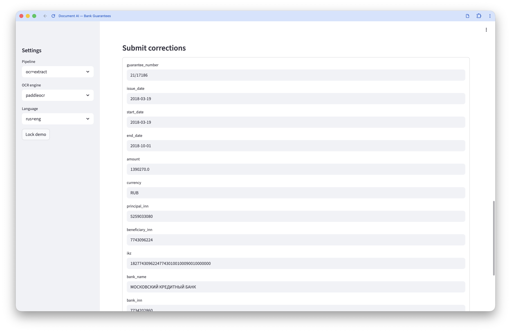

# Document AI PoC — Bank Guarantee Extraction Service

Production-oriented thesis repository for extracting structured fields from scanned Russian bank guarantees.

The system combines:
- local OCR (`tesseract` by default, optional `paddleocr`)
- local LLM extraction (`llama-cpp-python` + GGUF)
- async processing (FastAPI + Redis + worker)
- full validation/benchmarking CLI with reproducible sampling and metrics

No external inference APIs are required for runtime processing.

## Live Demo

The service is publicly deployed at **https://thesis-guarantee.ru/**

Features available in the public demo:
- **Upload & process** scanned bank guarantee PDFs (up to 10 MB)
- **View OCR output** — raw recognized text in Markdown
- **View extracted fields** — structured JSON with guarantee number, dates, amounts, INN, IKZ, bank details
- **Submit corrections** — human-in-the-loop correction form with versioned audit trail
- **Look up past jobs** — retrieve results by job ID

The demo is password-gated (macOS-style login window with random ASCII art and haiku). The FastAPI API is not exposed publicly.

### Screenshots

**Login gate:**

<!-- TODO: screenshot of the login window -->


**Main interface — OCR + extraction results:**

<!-- TODO:  screenshot of the main interface with results -->


**Upload tab — document preview before processing:**

<!-- TODO:  screenshot of the upload tab with PDF preview -->


**Correction form:**

<!-- TODO:  screenshot of the correction form -->


### Workflow (public demo)

1. **Log in** — enter the demo password in the macOS-style login window.
2. **Configure** — choose pipeline (`ocr+extract` or `ocr_only`), OCR engine (`tesseract` / `paddleocr`), and language in the sidebar.
3. **Upload a PDF** — select a scanned bank guarantee document. A preview of up to 4 pages is shown immediately.
4. **Process** — click "Process uploaded file". A progress bar tracks the job through `queued → running → succeeded`.
5. **Review results** — the left column shows OCR text (Markdown), the right column shows extracted JSON fields.
6. **Correct** — if any fields are wrong, edit them in the correction form and submit. Each correction is versioned.
7. **Look up past jobs** — switch to the "Job results" tab and enter a job ID to retrieve earlier results.
8. **Lock demo** — click "Lock demo" in the sidebar to return to the login gate.

Processing typically takes **2–3 minutes per document** on CPU. If the worker is busy, jobs wait in queue.

## Runtime Architecture

```
┌───────────┐      ┌──────────┐      ┌───────┐      ┌────────────┐
│ Streamlit │─────▶│ FastAPI  │─────▶│ Redis │─────▶│   Worker   │
│    UI     │◀─────│   API    │      │ Queue │      │ OCR + LLM  │
└───────────┘      └──────────┘      └───────┘      └────────────┘
                        │                                 │
                        ▼                                 ▼
                   ┌──────────┐                    ┌────────────┐
                   │ Postgres │                    │ Filesystem │
                   │  (audit) │                    │ (artifacts)│
                   └──────────┘                    └────────────┘
```

**Flow:** Upload PDF → API creates job → Redis enqueues → Worker runs OCR page-by-page → Worker runs LLM extraction → Results stored in Postgres + filesystem → Client polls for status/results.

## Key Extraction Details

- Extraction uses **schema v2 by default** (`app/llm/schemas.py`) for a compact output target.
- **Schema v1 is still present** for backward compatibility.
- LLM prompts are hardened for strict JSON output.
- Retry prompts include the full schema template.
- Oversized OCR inputs are trimmed to a context budget before generation.
- Constrained decoding via JSON Schema mode in llama-cpp-python ensures structurally valid output.

## Supported File Formats

PDF, TIF, TIFF, PNG, JPG/JPEG — multi-page TIFFs are handled page-by-page.

## Expected Processing Time

On a typical CPU (e.g. 4-core VM or Apple M-series laptop):
- **OCR** (Tesseract, 2-page PDF): ~1–3 seconds
- **LLM extraction** (Qwen3 4B Q5_K_M, 6144 context): ~60–120 seconds per document
- **End-to-end** (OCR + extract): **~2–3 minutes per document** on CPU

With CUDA GPU offload (e.g. Colab T4/A100), LLM extraction drops to ~5–15 seconds per document.

---

## Local Development

### Prerequisites

- Python 3.12+, [uv](https://docs.astral.sh/uv/)
- Tesseract OCR with Russian language pack (`brew install tesseract tesseract-lang` on macOS)
- PostgreSQL 14+ and Redis 7+ (or use Docker Compose for infra only)
- A GGUF model file — see [Model download](#model-download) below

### 1. Install dependencies

```bash
uv sync
# For development tools (pytest, ruff, etc.):
uv sync --extra dev
# Add `--extra paddle` if PaddleOCR is needed locally
```

#### llama-cpp-python install notes

**macOS (Apple Silicon / Metal acceleration):**

```bash
CMAKE_ARGS="-DGGML_METAL=on" pip install llama-cpp-python
```

The `uv sync` step installs the default wheel which already enables Metal on Apple Silicon. If you experience issues, reinstall with the flag above.

**Linux VM (CPU only):**

```bash
CMAKE_ARGS="-DGGML_BLAS=ON -DGGML_BLAS_VENDOR=OpenBLAS" pip install llama-cpp-python
```

Or simply `uv sync` — the default build uses CPU.

### 2. Configure environment

```bash
cp .env.example .env
# Edit .env — set DATABASE_URL, REDIS_URL, LLM_MODEL_PATH, ALLOWED_INPUT_ROOTS
# For public demo: set DEMO_PASSWORD to gate the Streamlit UI
```

### 3. Start infrastructure

```bash
# Option A: Docker Compose (recommended for Postgres + Redis only)
docker compose up -d postgres redis

# Option B: use local Postgres + Redis
```

Note: in Option A, Redis must be reachable from the host at `localhost:6379` (used by local `uv run` processes). If your worker/API logs show `Connection refused` for Redis, ensure the `redis` service publishes `127.0.0.1:6379:6379` in `docker-compose.yml`.

### 4. Run database migrations

```bash
uv run alembic upgrade head
```

### 5. Start services (in separate terminals)

```bash
uv run uvicorn app.main:app --host 0.0.0.0 --port 8000 --reload
uv run arq app.workers.tasks.WorkerSettings
uv run streamlit run streamlit_app.py
```

Open http://localhost:8501 in your browser.

### Model download

Download the default GGUF model into `./models/`:

```bash
uv run python -m app.cli.download_model
```

This downloads **Qwen3-4B-Instruct-2507-Q5_K_M.gguf** (~2.9 GB) from [unsloth/Qwen3-4B-Instruct-2507-GGUF](https://huggingface.co/unsloth/Qwen3-4B-Instruct-2507-GGUF) and saves it as `models/qwen3-4b-instruct-2507-q5_k_m.gguf`.

For faster downloads, authenticate with Hugging Face:

```bash
huggingface-cli login          # interactive, cached for future runs
export HF_TOKEN=hf_...         # or pass --token hf_...
```

If you already have a model file, place it in `./models/` and set `LLM_MODEL_PATH` in `.env`.

---

## Docker Compose (Full Stack Deployment)

Run the entire application with a single command — no local Python, Tesseract, or Postgres install needed.

### Prerequisites

1. Docker and Docker Compose installed
2. A GGUF model file placed in `./models/`
3. A `.env` file (`cp .env.example .env` — defaults work out of the box for Docker)
4. Optional: set `DOCKER_ENABLE_PADDLE=true` in `.env` to include PaddleOCR in the image

### Start

```bash
docker compose up --build
```

This will:
- Build the application image (installs Python, Tesseract, all dependencies)
- Start PostgreSQL and Redis
- Run database migrations automatically (Alembic)
- Start the API server, background worker, and Streamlit UI

### Access

| Service    | URL / Port              | Description                              |
|------------|-------------------------|------------------------------------------|
| Streamlit  | http://localhost:8501   | Web UI for document upload and results   |
| API docs   | http://localhost:8000/docs | Swagger / OpenAPI interface           |
| API        | http://localhost:8000   | REST API                                 |
| PostgreSQL | localhost:5432          | Database (user: postgres, pass: postgres, db: docai) |
| Redis      | localhost:6379          | Job queue                                |

For public deployment behind Caddy/reverse proxy, keep FastAPI internal and expose only Streamlit.

### Shared storage

All containers share a Docker volume (`app-data`) for:
- **Uploads** (`/app/data/uploads`) — files uploaded via the API; accessible by the worker for processing
- **Processed** (`/app/data/processed`) — OCR and extraction artifacts; accessible by Streamlit for display

The model directory (`./models/`) is bind-mounted read-only into all app containers.

### PaddleOCR in Docker (optional)

```bash
# .env
DOCKER_ENABLE_PADDLE=true

# rebuild image
docker compose up --build -d
```

Notes:
- `DOCKER_ENABLE_PADDLE=false` (default) keeps the image smaller.
- Paddle wheels are typically available on Linux `x86_64`; `aarch64` builds may fail.
- Pinned to `paddlepaddle==3.2.0` and `paddleocr==3.3.3` for stability.
- Paddle model cache is persisted at `PADDLE_PDX_CACHE_HOME` (compose default: `/app/data/paddle-cache`).

### Stop / reset

```bash
# Stop all services (data persists)
docker compose down

# Stop and delete all data (clean slate)
docker compose down -v
```

### Migrating to a remote server

1. Copy the project to the server
2. Place the GGUF model in `./models/`
3. Copy or create `.env` (set `ADMIN_API_KEY`, `DEMO_PASSWORD`; set `DOCKER_ENABLE_PADDLE=true` only if compatible)
4. Run `docker compose up --build -d`
5. Expose Streamlit (e.g. via Caddy) at your domain; keep API internal

---

## API Endpoints

The REST API is **not publicly exposed** at https://thesis-guarantee.ru/ — only the Streamlit UI is available to public users. However, when running locally, the full API is accessible at `http://localhost:8000`.

### Create job (file upload)

```bash
curl -X POST http://localhost:8000/v1/jobs \
  -F "file=@guarantee.pdf" \
  -F "pipeline=ocr+extract" \
  -F "engine_ocr=tesseract"
```

### Create job (server-side path)

```bash
curl -X POST http://localhost:8000/v1/jobs/by-path \
  -H "Content-Type: application/json" \
  -d '{"file_path": "/data/raw/attachments/1589112/1589112_1.pdf"}'
```

### Poll job status

```bash
curl http://localhost:8000/v1/jobs/{job_id}
```

### Get results

```bash
curl http://localhost:8000/v1/jobs/{job_id}/result
```

### Submit corrections

```bash
curl -X POST http://localhost:8000/v1/jobs/{job_id}/corrections \
  -H "Content-Type: application/json" \
  -d '{"fields": {"guarantee_number": "BG-001-CORRECTED"}, "comment": "Fixed typo"}'
```

### Admin endpoints (require API key)

Protected by `ADMIN_API_KEY`. Pass it via the `X-API-Key` header:

```bash
curl http://localhost:8000/v1/admin/health \
  -H "X-API-Key: my-secret-key-123"

curl "http://localhost:8000/v1/admin/jobs?status=succeeded&limit=10" \
  -H "X-API-Key: my-secret-key-123"
```

A missing or wrong key returns `403 Forbidden`. If `ADMIN_API_KEY` is empty, all admin endpoints are locked.

---

## Validation & Metrics (Thesis Experiments)

A standalone CLI subsystem for systematic evaluation of OCR + extraction quality against a ground-truth dataset.

### What it does

1. **Samples** N documents reproducibly from `dataset.csv` (~33k bank guarantee records).
2. **Processes** each document through a configurable pipeline: OCR engine + extractor (LLM or regex baseline).
3. **Normalises** both predictions and gold values (digits-only for INNs/IKZ, ISO dates, currency codes, robust float parsing).
4. **Computes metrics** — field-level exact match, slot-filling P/R/F1, Doc-EM, edit similarity, digit accuracy, amount MAE, latency percentiles, weighted scores.
5. **Generates** a Markdown report comparing all system configurations side-by-side.

Processing is **parallel** (multiprocessing for OCR, controlled concurrency for LLM) and **resumable** (checkpointed every batch to parquet).

### CLI commands

All commands:

```bash
uv run python -m app.cli.validate <command> [options]
```

#### `sample` — create a reproducible document subset

```bash
uv run python -m app.cli.validate sample --n 200 --seed 42
# Output: data/processed/validation/seeds/seed_n=200_seed=42.csv
```

#### `run` — process documents through OCR + extraction

```bash
# Tesseract + LLM
uv run python -m app.cli.validate run \
  --seed-file data/processed/validation/seeds/seed_n=200_seed=42.csv \
  --ocr-engine tesseract --extractor llm \
  --llm-model models/qwen3-4b-instruct-2507-q5_k_m.gguf \
  --workers 4 --batch-size 32

# PaddleOCR + LLM
uv run python -m app.cli.validate run \
  --seed-file data/processed/validation/seeds/seed_n=200_seed=42.csv \
  --ocr-engine paddleocr --extractor llm \
  --llm-model models/qwen3-4b-instruct-2507-q5_k_m.gguf \
  --workers 2

# Tesseract + regex baseline
uv run python -m app.cli.validate run \
  --seed-file data/processed/validation/seeds/seed_n=200_seed=42.csv \
  --ocr-engine tesseract --extractor regex --workers 4
```

Options:
- `--ocr-engine {tesseract,paddleocr}` — OCR backend (required)
- `--extractor {llm,regex}` — extraction method (required)
- `--llm-model <path>` — GGUF model file (required for `--extractor llm`)
- `--llm-device {cpu,cuda}` — validation LLM device (default: `cpu`)
- `--llm-n-gpu-layers <int>` — llama-cpp `n_gpu_layers` (`0` for CPU, `-1` for full offload)
- `--workers <int>` — OCR/regex parallelism (default: 2)
- `--llm-workers <int>` — LLM concurrency (default: 1)
- `--batch-size <int>` — checkpoint every N docs (default: 32)
- `--resume / --no-resume` — resume from last checkpoint (default: resume)
- `--keep-artifacts / --no-keep-artifacts` — retain OCR markdown and extraction JSON per doc (default: false)
- `--lang <str>` — OCR language code (default: `rus+eng`)

Extraction defaults to compact **schema v2**. Schema v1 remains for backward compatibility.

**Resuming:** progress is saved to `results.parquet` every `--batch-size` documents. If interrupted, re-run the same command and already-processed documents are skipped.

#### `metrics` — compute metrics and generate report

```bash
# Single run
uv run python -m app.cli.validate metrics \
  --run-id <run_id> --out-md report.md

# Compare multiple runs
uv run python -m app.cli.validate metrics \
  --run-id "<id1>,<id2>,<id3>,<id4>" --out-md report.md

# With custom field weights
uv run python -m app.cli.validate metrics \
  --run-id <run_id> --out-md report.md \
  --weights weights.json --out-json metrics.json
```

### Building a validation document bundle

To create a portable archive of sampled documents (useful for running validation on a remote machine or Colab):

```bash
uv run python app/validation/bundle_validation_sample.py \
  --seed-file data/processed/validation/seeds/seed_n=200_seed=42.csv \
  --out-dir data/processed/validation/bundles/n200_seed42 \
  --archive data/processed/validation/bundles/n200_seed42.tar.gz
```

This copies all referenced documents into a flat `docs/` folder, rewrites `stored_path` values to portable relative paths, and optionally creates a `.tar.gz` or `.zip` archive.

To fetch a pre-built bundle from Dropbox:

```bash
bash scripts/fetch_validation_bundle.sh \
  "https://www.dropbox.com/scl/fi/<id>/validation_bundle.tar.gz?dl=0" \
  data/processed/validation/bundles/from_dropbox \
  validation_bundle.tar.gz
```

### Metrics included

| Metric | Description |
|--------|-------------|
| **Field accuracy** (micro/macro) | Fraction of exact matches per field after normalisation |
| **Slot P/R/F1** (micro/macro) | TP if match, FP+FN if wrong, FN if missing |
| **Doc-EM** | 1 if all required fields match for a document |
| **Normalised edit similarity** | Levenshtein-based, ANLS-style |
| **Digit accuracy** | Position-aligned digit match ratio (INN/IKZ) |
| **Amount MAE** | Mean absolute error on `sum` |
| **Amount tolerance accuracy** | Fraction within configurable epsilon (default 0.01) |
| **Latency** | Median, P95, P99 for OCR / extraction / total |
| **Weighted field accuracy** | User-supplied per-field weights |

### Normalisation rules

Applied to both gold and predicted values before comparison:

- **INN / IKZ**: strip all non-digits; empty → null. Leading zeros preserved.
- **Dates**: parse to `YYYY-MM-DD`. Accepts `DD.MM.YYYY`, `DD/MM/YYYY`, ISO, and 2-digit year formats.
- **Currency**: map Russian variants (`руб.`, `рублей`, `₽`, `RUR`) → `RUB`; `долларов` → `USD`; `евро` → `EUR`.
- **Amount**: strip non-numeric characters, accept comma as decimal separator, round to 2 decimal places for equality, keep raw numeric for MAE.

### Output structure

```
data/processed/validation/
├── seeds/
│   └── seed_n=200_seed=42.csv
└── runs/
    └── <run_id>/
        ├── metadata.json       # run config, machine info, timestamps
        ├── results.parquet     # per-doc predictions, gold, diagnostics, timings
        └── artifacts/          # (only with --keep-artifacts)
            └── <doc_id>/
                ├── ocr.md
                └── extraction.json
```

### CUDA option for validation-only LLM runs

Service defaults remain CPU-oriented; GPU tuning is exposed only in the validation CLI:

```bash
uv run --no-sync python -m app.cli.validate run \
  --seed-file data/processed/validation/seeds/seed_n=200_seed=42.csv \
  --ocr-engine tesseract --extractor llm \
  --llm-model models/qwen3-4b-instruct-2507-q5_k_m.gguf \
  --llm-device cuda --llm-n-gpu-layers -1
```

### Colab GPU setup (validation-only)

```bash
# System deps
apt-get update && apt-get install -y tesseract-ocr tesseract-ocr-rus tesseract-ocr-eng

# One-command setup: sync (colab extra) + CUDA rebuild + verification
bash scripts/colab_gpu_setup.sh

# With PaddleOCR CPU runtime + compatibility checks
COLAB_WITH_PADDLE=1 bash scripts/colab_gpu_setup.sh
```

Important in Colab: prefer `uv run --no-sync ...` after CUDA install. In notebooks, use `%env UV_NO_SYNC=1` (not `!export`) to persist across cells.

---

## Running Tests

```bash
uv sync --extra dev
uv run pytest -q
```

`pytest` is **not** included in core dependencies — it is part of the `dev` extra. Tests use an in-memory SQLite database and mock the Redis queue + LLM engine; no real infrastructure is needed.

---

## Environment Variables

| Variable              | Default                        | Description                              |
|-----------------------|--------------------------------|------------------------------------------|
| `DATABASE_URL`        | `postgresql+asyncpg://…`       | Async Postgres connection string         |
| `REDIS_URL`           | `redis://localhost:6379/0`     | Redis for arq job queue                  |
| `ADMIN_API_KEY`       | (empty)                        | API key for admin endpoints              |
| `DEMO_PASSWORD`       | (empty)                        | Streamlit public demo login password     |
| `LLM_MODEL_PATH`     | `models/qwen3-4b-…q5_k_m.gguf`| Path to GGUF model file                  |
| `LLM_N_CTX`          | `6144`                         | LLM context window                       |
| `LLM_MAX_TOKENS`     | `512`                          | Max tokens for LLM response              |
| `LLM_TEMPERATURE`    | `0.0`                          | LLM temperature (0 = deterministic)      |
| `LLM_TOP_P`          | `1.0`                          | Top-p sampling parameter                 |
| `LLM_THREADS`        | `4`                            | CPU threads for LLM inference            |
| `LLM_MAX_RETRIES`    | `2`                            | Retry count for failed JSON validation   |
| `DEFAULT_OCR_ENGINE`  | `tesseract`                   | Default OCR engine                       |
| `TESSERACT_CMD`       | `tesseract`                   | Path to tesseract binary                 |
| `PADDLE_PDX_CACHE_HOME` | `data/paddle-cache`        | Persistent Paddle model cache directory  |
| `PROCESSED_DIR`       | `data/processed`              | Root for output artifacts                |
| `UPLOAD_DIR`          | `data/uploads`                | Directory for uploaded files             |
| `COPY_SOURCE_PDF`     | `false`                       | Copy source PDF into output directory    |
| `ALLOWED_INPUT_ROOTS` | (empty)                        | Semicolon-separated allowed path roots   |
| `WORKER_MAX_JOBS`     | `2`                            | Max concurrent jobs per worker           |
| `DOCKER_ENABLE_PADDLE`| `false`                        | Docker Compose build flag: include PaddleOCR deps |

---

## Project Structure

```
app/
├── main.py                            # FastAPI application entry point
├── api/
│   ├── deps.py                        # Dependency injection (DB session)
│   └── v1/
│       ├── jobs.py                    # Job CRUD + corrections endpoints
│       └── admin.py                   # Admin endpoints (API-key protected)
├── core/
│   ├── config.py                      # Pydantic settings from .env
│   ├── logging.py                     # Structured logging setup
│   └── security.py                    # API key + file path validation
├── db/
│   ├── base.py                        # SQLAlchemy DeclarativeBase
│   ├── models.py                      # ORM: Job, Artifact, Extraction, Correction
│   └── session.py                     # Async engine and session factory
├── ocr/
│   ├── base.py                        # OCR engine interface + result models
│   ├── preprocess.py                  # Image preprocessing (Otsu, sharpen)
│   ├── tesseract.py                   # Tesseract engine
│   └── paddle.py                      # PaddleOCR engine (optional)
├── llm/
│   ├── engine.py                      # llama-cpp-python wrapper (singleton)
│   ├── schemas.py                     # Extraction v1/v2 Pydantic models + validators
│   ├── prompts.py                     # System/user prompt templates
│   ├── extract.py                     # Extraction with retry logic + context budgeting
│   └── postprocess.py                 # Post-extraction normalisation
├── services/
│   ├── jobs.py                        # Job lifecycle (DB operations)
│   └── pipeline.py                    # OCR + LLM orchestration
├── storage/
│   ├── paths.py                       # Deterministic output paths
│   └── writer.py                      # Artifact serialisation
├── workers/
│   └── tasks.py                       # arq worker tasks
├── validation/
│   ├── normalize.py                   # Field normalisation rules
│   ├── metrics.py                     # Metric computation engine
│   ├── regex_baseline.py              # Regex-based baseline extractor
│   ├── runner.py                      # Parallel, resumable evaluation runner
│   ├── report.py                      # Markdown report generator
│   ├── storage.py                     # Parquet-based result storage
│   └── bundle_validation_sample.py    # Bundle builder for portable validation sets
├── cli/
│   ├── ocr.py                         # Bulk OCR CLI
│   ├── validate.py                    # Validation CLI (sample, run, metrics)
│   ├── evaluate.py                    # Legacy evaluation scaffold
│   └── download_model.py             # GGUF model downloader (HuggingFace)
├── schemas/
│   └── jobs.py                        # API request/response models
├── ui/
│   ├── demo_content.py                # ASCII art + haiku pools for login gate
│   └── login_gate.py                  # Streamlit password gate (macOS-style)
streamlit_app.py                       # Streamlit frontend
.streamlit/
├── config.toml                        # Streamlit server config (maxUploadSize=10)
└── icon.png                           # Browser tab icon
tests/
├── conftest.py                        # Fixtures (in-memory DB, mocked queue)
├── test_api_jobs.py                   # API endpoint tests
├── test_extraction.py                 # LLM extraction + validation tests
└── test_corrections.py                # Correction submission tests
alembic/                               # Database migrations
docker/
├── Dockerfile                         # App image (Tesseract, optional Paddle via ENABLE_PADDLE)
└── entrypoint.sh                      # api | worker | streamlit | migrate
scripts/
├── colab_gpu_setup.sh                 # Colab CUDA/Paddle setup helper
└── fetch_validation_bundle.sh         # Download validation bundle from Dropbox
samples/                               # Example bank guarantee PDFs for the demo
docker-compose.yml                     # Full stack orchestration
pyproject.toml                         # Project metadata + dependencies
```

## License

MIT
